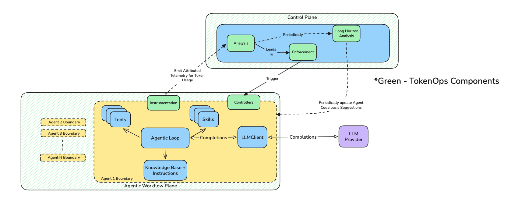

# TokenOps

**Run-aware token governance for AI agents.**

TokenOps is a control plane that sits alongside your agent (data plane). It measures spend as it accrues, attributes it to the right run and customer context, and enforces deterministic policies — before and after each model, tool, and delegation call.

---

## Contents

1. [Principles](./docs/principles.md) — how we think about token spend
2. [Workflow](./docs/workflow.md) — what happens on each agent run
3. [Demo bench walkthrough](./docs/demo-bench.md) — screenshots from the reference two-agent bench
4. [Policies & actions](./docs/policies-and-actions.md) — what ships today
5. [Contact & onboarding](./docs/contact.md)

---

## The problem in one sentence

A **request** is one model call; a **run** is the whole task — many calls, tools, and sub-agents. Gateways see requests one at a time. TokenOps governs the **run**: loops, growing context, fan-out, and runaway cost.

## Architecture at a glance

```
  data plane (your agent)          control plane (TokenOps)
  ─────────────────────          ──────────────────────────
  model / tool / delegate   →    measure + attribute + enforce
                                 budgets · policies · ledger
```



| Layer | Sees | Can govern |
|---|---|---|
| API gateway / proxy | Independent requests | Per-request rate, routing, coarse caps |
| **TokenOps** | Full **run**: step sequence, context, delegation | Loops, stalls, context decay, fan-out, per-run and per-customer spend |

## Why out-of-band enforcement

Policies live **outside** the agent so the agent cannot rewrite or bypass them. Checks sit **in the call path** so spend is stopped before it lands. That combination — out-of-band rules, in-path enforcement — is what makes a budget a guarantee rather than an alert.

## Reference demo

The pages below walk through a **two-agent research bench** (research → summarize). It is a teaching harness, not the production deployment shape. The same control-plane concepts apply to single-agent and multi-agent pipelines.

---

*TokenOps is developed by [Agent Plane](https://github.com/theagentplane).*
