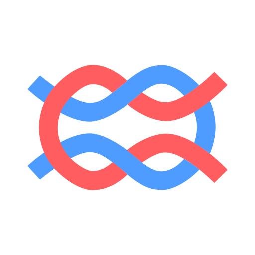

# How TokenOps compares

TokenOps governs the **run** — a full agent workflow across many model, tool, and delegation calls. Gateways and observability tools typically scope to individual **requests** or **traces**.

<table>
<thead>
<tr>
<th align="left">Capability</th>
<th align="left">Example</th>
<th align="left"> TokenOps</th>
<th align="left"> LiteLLM</th>
<th align="left"> Portkey</th>
<th align="left"> Cloudflare AI Gateway</th>
<th align="left"> Langfuse</th>
</tr>
</thead>
<tbody>
<tr>
<td><strong>Primary Focus</strong></td>
<td>What is fundamentally being governed?</td>
<td>Run (stateful)</td>
<td>Request</td>
<td>Request</td>
<td>Request</td>
<td>Request (trace)</td>
</tr>
<tr>
<td><strong>Execution Scope</strong></td>
<td>Research Agent → Summarizer Agent → Reviewer</td>
<td>Full multi-agent workflow</td>
<td>Single request</td>
<td>Single request</td>
<td>Single request</td>
<td>Trace spans (observed)</td>
</tr>
<tr>
<td><strong>Cost Measurement</strong></td>
<td>Total spend across an entire workflow</td>
<td>Cumulative &amp; tunable</td>
<td>Per-request</td>
<td>Per-request</td>
<td>Per-request</td>
<td>Per-trace</td>
</tr>
<tr>
<td><strong>Budget Enforcement</strong></td>
<td>"$0.50 per run" or "$5 per customer/day"</td>
<td>Yes (run-aware context)</td>
<td>Yes (team/key)</td>
<td>Yes (virtual key)</td>
<td>Yes (identity)</td>
<td>No (analytics only)</td>
</tr>
<tr>
<td><strong>Steering Capability</strong></td>
<td>Swap model, shorten output, inject guidance</td>
<td>Full (mutate/inject)</td>
<td>Minimal (routing)</td>
<td>Low (fallbacks)</td>
<td>Low (routing)</td>
<td>None</td>
</tr>
<tr>
<td><strong>Enforcement Point</strong></td>
<td>Before the next model/tool call executes</td>
<td>In-path (deterministic)</td>
<td>In-path (gateway)</td>
<td>In-path (gateway)</td>
<td>In-path (gateway)</td>
<td>Out-of-band</td>
</tr>
<tr>
<td><strong>Fail-Closed Integrity</strong></td>
<td>Missing registration or exceeded budget</td>
<td>Native/strict</td>
<td>Optional</td>
<td>Limited</td>
<td>No</td>
<td>No</td>
</tr>
</tbody>
</table>

**Primary Focus** — TokenOps tracks state across an entire agent task (`run_id`). Gateways see independent API calls; Langfuse records traces for analysis after the fact.

**Execution Scope** — A research → summarize → review pipeline is one governed unit in TokenOps. Other tools scope to a single hop unless you stitch traces manually.

**Budget Enforcement** — TokenOps caps can bind to run, user, or tag dimensions with run-aware context. Langfuse reports spend but does not enforce caps in the call path.

**Steering Capability** — TokenOps can mutate the next call (model, output cap, prompt) or inject corrections into the conversation. Gateways offer routing and fallbacks; Langfuse does not steer execution.

**Fail-Closed Integrity** — TokenOps refuses telemetry without registration and halts on budget breach by default. Other tools treat limits as optional or report-only.

---

[Back to overview](../README.md)
