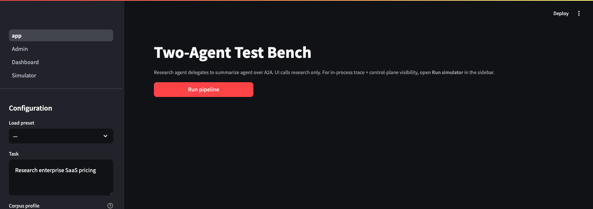
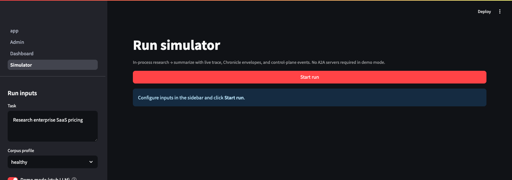
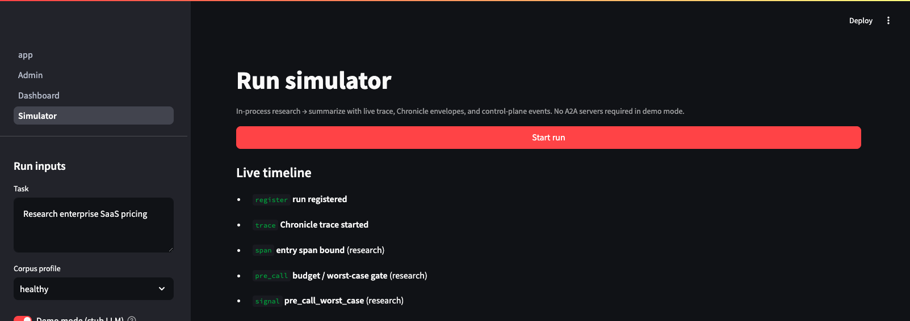
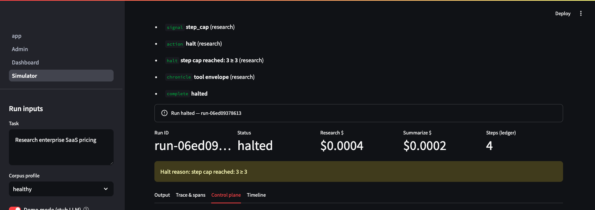
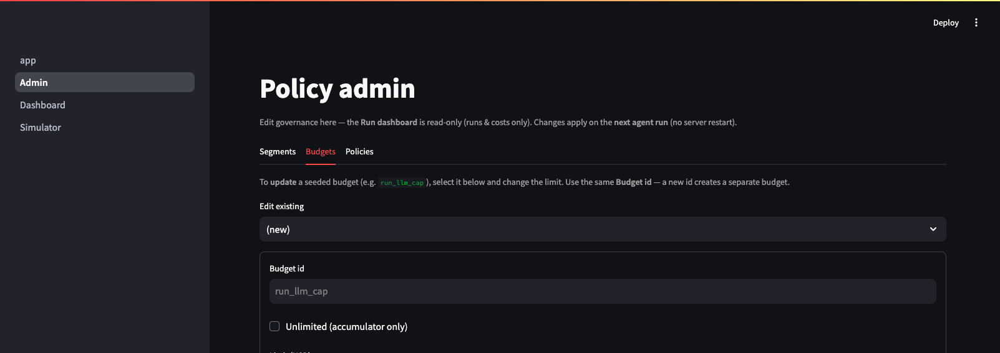
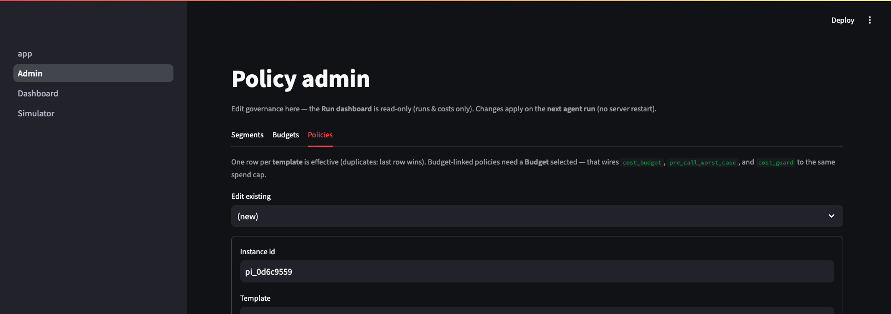
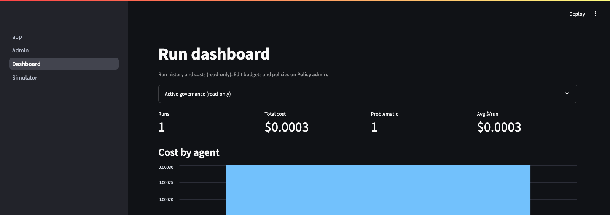

# Demo bench walkthrough

The reference **two-agent test bench** demonstrates TokenOps on a research → summarize pipeline. Screenshots below are from the local Streamlit UI shipped with the demo harness.

## Pages

| Page | Purpose |
|---|---|
| **Test Bench** | Live pipeline — research agent delegates to summarize over HTTP |
| **Run simulator** | In-process run with live timeline, trace, and control-plane tabs |
| **Policy admin** | Edit budgets, policies, and segments |
| **Dashboard** | Run history, aggregate cost, problematic runs |

---

## 1. Test Bench — trigger a live run

Configure task, corpus profile, and agent endpoints in the sidebar. Click **Run pipeline** to send a task to the research agent, which delegates to summarize.



---

## 2. Run simulator — in-process demo (no API keys required)

**Demo mode** uses a stub LLM so you can explore governance without provider credentials. Click **Start run** to execute research → summarize in one process.



### Live timeline

As the run progresses, events stream in: registration, span binding, `pre_call` gates, each `observe`, delegate, and policy signals.



### Policy halt example

In this capture, **`step_cap`** tripped after three ledger steps (`step cap reached: 3 ≥ 3`). The run status is **halted**, with research and summarize cost broken out separately.

Metrics shown:

- Run ID and status
- Cost by agent (research vs summarize)
- Ledger step count
- Halt reason

### Control plane tab

The **Control plane** tab shows policy signals, actions (`mutate`, `halt`), and per-agent ledger windows — what the detectors saw when they fired.



Other tabs (not shown): **Trace & spans** (span context, tool envelopes), **Timeline** (full event log).

---

## 3. Policy admin — configure governance

### Budgets

Define spend caps bound to a dimension (demo default: **$2.00 per run** on `run_llm_cap`).



### Policies

Attach policy templates to budgets and agents. Example: `concurrency_cap` with max four in-flight calls, reject mode.



**Effective governance config** at the bottom of the admin page previews what the next run will enforce.

---

## 4. Dashboard — run history and cost

Read-only view of completed and problematic runs. Toggle **Problematic only** to filter halted or throttled runs. Expand **Active governance** to see armed budgets and policies.



In the screenshot above: one run, total cost ~$0.0003, one problematic (halted) run — matching the step-cap demo.

---

## Try it yourself

The demo harness is in the private `tokenops` product repo (not required to read this wiki). Operators with repo access:

```bash
make install
make db-reset    # seed default governance
make run         # agents + UI at http://localhost:8501
```

To reproduce the halt screenshot: Policy admin → edit `step_cap` → set `max_steps` to **3** → Run simulator → Start run.

---

[Back to overview](../README.md) · [Workflow](./workflow.md) · [Policies & actions](./policies-and-actions.md)
