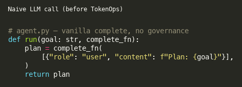
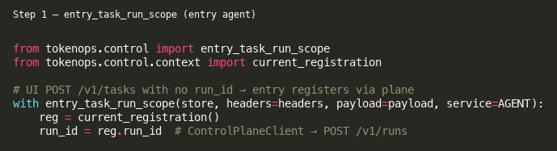
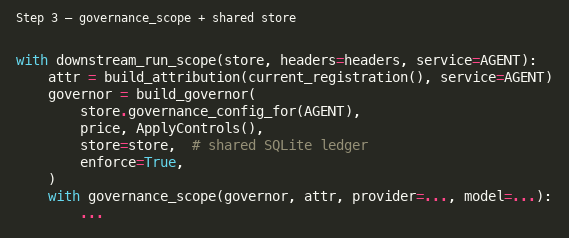
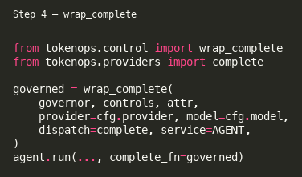
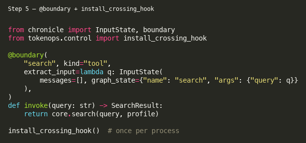

# Field guide: adding TokenOps to the triad bench

This walkthrough mirrors how TokenOps was wired into the **Planner → Researcher → Writer**
bench under [`examples/triad/`](../examples/triad/). Code screenshots below were generated with
`python scripts/render_field_guide_snippets.py` → [`docs/field-guide/assets/`](field-guide/assets/).

Core library: [theagentplane/tokenops](https://github.com/theagentplane/tokenops).
Related core docs: [CONTROL_PLANE.md](https://github.com/theagentplane/tokenops/blob/main/CONTROL_PLANE.md),
[control-plane-deploy.md](https://github.com/theagentplane/tokenops/blob/main/docs/control-plane-deploy.md),
[run-attribution.md](https://github.com/theagentplane/tokenops/blob/main/docs/run-attribution.md).
Copilot skill: [integrate-tokenops](https://github.com/theagentplane/tokenops/blob/main/.cursor/skills/integrate-tokenops/SKILL.md).

## Shape

| Agent | Port | Role | TokenOps seams |
|-------|------|------|----------------|
| **Planner** | 8011 | Break goal into questions + outline; **entry** | `entry_task_run_scope` → `wrap_complete` → A2A hops (span headers) |
| **Researcher** | 8012 | Tools (`search` / `fetch`) gather facts | `downstream_run_scope` → `wrap_complete` + `@boundary` + crossing hook |
| **Writer** | 8013 | Final answer from findings | `downstream_run_scope` → `wrap_complete` |

Naive agent logic lives in each `agent.py`. Instrumentation lives in each `server.py`
(and `researcher/tools.py` for tool boundaries).

```
UI: POST /v1/tasks  (no run_id)
        │
        ▼
     Planner  entry_task_run_scope → ControlPlaneClient.register_run → plane POST /v1/runs
              │ wrap_complete (plan LLM)
              │ post_task → merge_propagation_headers (run_id + parent span)
              ▼
         Researcher
              │ wrap_complete + @boundary(search/fetch)
              │ child spend → shared ledger (same run_id)
              ▼
           Planner
              │ post_task → Writer (same headers)
              ▼
            Writer
              │ wrap_complete → shared ledger
              ▼
           Planner → TaskResponse (no parent cost rollup)
```

### Before: naive complete

Agent code stays injectable — no TokenOps imports in `agent.py`:



<details>
<summary>SVG fallback</summary>


</details>

## Step 1 — Entry agent registers the run (not the UI)

The UI calls **Planner** `POST /v1/tasks` without a run id. The Planner (entry agent)
opens the run via `ControlPlaneClient.register_run` → plane `POST /v1/runs` (or
embedded Store), then executes the task under that `run_id`:



```python
# Inside Planner server (entry_task_run_scope):
# if X-TokenOps-Run-Id missing → ControlPlaneClient.register_run(...)
# then bind context and handle the task
```

Downstream Researcher/Writer receive the same `run_id` via auto-injected headers
(`merge_propagation_headers` on A2A `post_task`).

See `examples/triad/client.py` (`submit_goal_sync_with_meta` — UI path, no client register)
and `tokenops.control.attribution.entry_task_run_scope`.

## Step 2 — Propagate `run_id` on every A2A hop

Prefer ambient headers: A2A `post_task` / `post_task_sync` call
`merge_propagation_headers`, so outbound hops inherit `X-TokenOps-Run-Id` and
`X-TokenOps-Parent-Span-Id` from the current governance context.

```python
# Optional explicit override (usually unnecessary inside a governed handler):
from tokenops.control.context import RUN_ID_HEADER, PARENT_SPAN_ID_HEADER

headers = {RUN_ID_HEADER: run_id}
if parent_span_id:
    headers[PARENT_SPAN_ID_HEADER] = parent_span_id
```

Downstream agents resolve via `downstream_run_scope`. Missing `run_id` on a **non-entry**
hop soft-registers an `unattributed` run and logs `tokenops.missing_run_id` (do not rely
on that for the happy path — always propagate from the entry agent).

## Step 3 — Open governance scope + build governor

Each server handler (Planner / Researcher / Writer) follows the same pattern:



```python
with downstream_run_scope(store, headers=headers, service=AGENT):
    reg = current_registration()
    attr = build_attribution(reg, service=AGENT)
    controls = ApplyControls()  # or PreviewControls()
    governor = build_governor(
        store.governance_config_for(AGENT),
        price,
        controls,
        store=store,          # shared SQLite ledger across processes
        enforce=True,
    )
    governor.ledger.open_run(run_id)
    store.create_run(RunRecord(run_id=run_id, agent=AGENT, status="running", ...))

    with governance_scope(governor, attr, provider=..., model=...):
        ...
```

`store=store` is what makes **cost_budget** / **step_cap** shared across the three processes
for one `run_id`.

## Step 4 — Wrap the LLM (`wrap_complete`)

Replace the bare provider call with a governed dispatch:



```python
from tokenops.control import wrap_complete
from tokenops.providers import complete

governed = wrap_complete(
    governor, controls, attr,
    provider=cfg.provider,
    model=cfg.model,
    dispatch=complete,
    service=AGENT,
)
# Pass governed into the naive agent as complete_fn
agent.run(..., complete_fn=governed)
```

`wrap_complete` runs **pre_call** policies (e.g. `pre_call_worst_case`, `cost_guard`) and
emits LLM observations for **observe** policies (`cost_budget`, `step_cap`, …).

## Step 5 — Tool boundaries (`@boundary` + crossing hook)

On the Researcher, tools are Chronicle boundaries so TokenOps can observe tool crossings
without changing the agent loop:



```python
from chronicle import InputState, boundary

@boundary(
    "search",
    kind="tool",
    extract_input=lambda query: InputState(
        messages=[], graph_state={"name": "search", "args": {"query": query}}
    ),
)
def invoke(query: str) -> SearchResult:
    return core.search(query, profile)
```

Install the process-wide hook once per server:

```python
from tokenops.control import install_crossing_hook

install_crossing_hook()
```

That wires Chronicle `on_crossing` → `Governor.observe` (see `tokenops.control.crossing`).

`tool_freq` / `tool_output_cap` in the seed registry include `search` and `fetch`
(`examples/config/triad.yaml`).

## Step 6 — Delegates: spans only (no parent cost rollup)

A2A hops open a **new span** with `X-TokenOps-Parent-Span-Id` set from the caller
(ambient propagation). Child LLM/tool spend is written to the **shared ledger** for the
same `run_id`. The parent must **not** call `observation_from_delegate` to re-add
`cost_micros` (that double-counted).

Refuse to delegate when the shared run budget is already exhausted
(`ledger.budget_left("run_llm_cap", ...)`) — still allowed as a local check.

## Step 7 — Errors and HTTP surface

```python
app = create_a2a_app(..., handler=with_governance_errors(handler))
if should_mount_run_registration():
    mount_run_registration(app, store)  # only when not using TOKENOPS_URL plane
install_crossing_hook()
```

`with_governance_errors` maps `Halt` / registration errors to HTTP responses the client can
inspect (`status`, `halt_reason`, `cost_micros`).

## Governance seed (demo)

`examples/config/triad.yaml` seeds:

- **cost_budget** on `run_llm_cap` ($0.50 / run) — easier to trip than the $2 two-agent default
- **step_cap** at 12 steps across the hoppy pipeline
- **tool_freq** registry `[search, fetch]`

Reset / reseed:

```bash
TOKENOPS_CONFIG=examples/config/triad.yaml make db-reset
```

## How to run

```bash
# Local processes
make triad
# or: make control-plane && make writer-server && make researcher-server && make planner-server

# Docker (plane + triad; keeps default research/summarize compose intact)
docker compose -f docker-compose.yml -f docker-compose.triad.yml up --build tokenops planner researcher writer

# Client
export TOKENOPS_URL=http://localhost:7700
python -c "
from examples.triad import submit_goal_sync_with_meta
r, meta = submit_goal_sync_with_meta('http://localhost:8011', 'Explain mid-market CRM pricing')
print(meta['status'], meta['cost_micros'], r.summary[:200])
"

# Tests (mocked LLM)
python -m pytest tests/test_triad_e2e.py -q
```

## Regenerating screenshots

```bash
python scripts/render_field_guide_snippets.py
# writes docs/field-guide/assets/{01..05}-*.{svg,png}
```

## Checklist for a new agent

1. Keep `agent.py` vanilla (injectable `complete_fn`).
2. **Entry** agent: `entry_task_run_scope` (registers when UI omits `run_id`).
   **Downstream**: `downstream_run_scope`.
3. In `server.py`: `build_governor(..., store=store)` → `governance_scope` →
   `wrap_complete` → `with_governance_errors` → `install_crossing_hook`.
4. Mark tools with Chronicle `@boundary`; rely on the crossing hook for observe.
5. Propagate `X-TokenOps-Run-Id` (and parent span) on every outbound A2A call
   (`merge_propagation_headers` / ambient context).
6. Do **not** re-bill child `cost_micros` on the parent (`observation_from_delegate`
   double-counts against the shared ledger).
