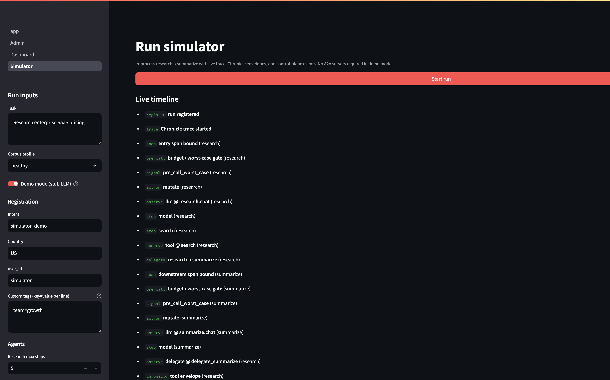
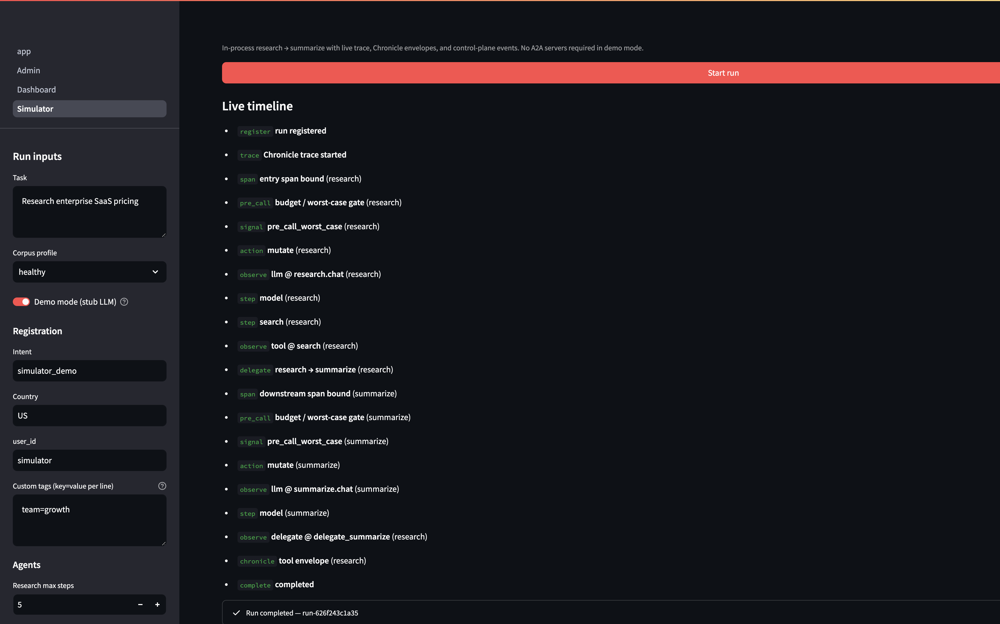
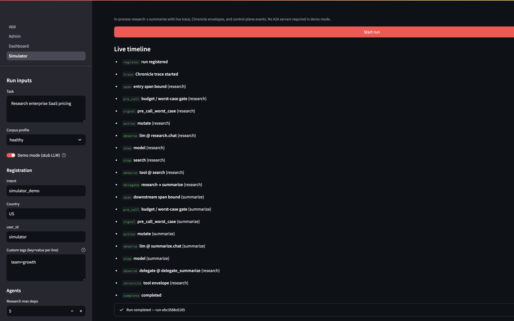

# Multi-agent budgets: shared ledger

In a **research → summarize** pipeline, both agents share one `run_id` and one run-level budget (`run_llm_cap`). Before shared-ledger backing, each agent process built its own in-memory ledger — so each saw the **full** cap independently. Combined spend could exceed the run budget even though every agent stayed “within cap” locally.

TokenOps now persists **spend, inflight, and halt** in SQLite (`ledger_*` tables in `tokenops.db`). Every `Governor` backed by the same store enforces **one** accumulator per `run_id`.

## What stays local vs shared

| State | Scope |
|---|---|
| Spend, inflight, halt | **Shared** across agent processes (same `run_id`) |
| Step window, local step count | **Per process** (each agent’s own `RunState`) |

Research also checks `budget_left` **before delegating** to summarize — if the run cap is exhausted, delegation is refused.

## Demo: $0.001 run cap

With the reference bench in **demo mode** (stub LLM, healthy corpus, offline search), a typical run costs ~**$0.0012** total. Set `run_llm_cap` to **$0.001** to see the contrast:

| | Before (per-process ledger) | After (shared SQLite ledger) |
|---|---|---|
| **Status** | `completed` | `halted` |
| **Research $** | $0.0010 | $0.0008 |
| **Summarize $** | $0.0002 | $0.0000 |
| **Total run $** | **$0.0012** (over cap) | **$0.0008** (within cap) |
| **Halt reason** | — | `pre_call_worst_case` blocks summarize |


### Before — separate ledgers

Research spends against its ledger; summarize opens a **fresh** ledger with the full cap. The run **completes** even though combined spend exceeds the budget.





### After — shared spend

Research spend is written to SQLite. When summarize starts, remaining headroom is ~$0.0002 — not enough for the next LLM call’s worst-case cost. `pre_call_worst_case` **halts** before summarize runs.




## Why this matters

| Gateway / proxy | TokenOps shared ledger |
|---|---|
| Per-request caps | **Per-run** cap across all agents |
| Each service meters independently | One spend truth for the whole workflow |
| Overspend discovered after the fact | Block the next crossing before it executes |

This is the difference between “each hop looked fine” and “the **run** stayed within budget.”

## Try it (TokenOps repo)

```bash
python scripts/prep_ledger_comparison.py   # sets run_llm_cap to $0.001
SEARCH_BACKEND=corpus make ui              # reproducible stub search
```

**Run simulator → Start run** (demo mode on, healthy corpus). The summary bar shows **Total run $** and **Run budget cap** with over/within delta.

Implementation details and tests live in the [TokenOps repo](https://github.com/theagentplane/tokenops) (`docs/shared-ledger-comparison.md`, `tests/test_cross_process_budget_gating.py`).

---

[Back to overview](../README.md) · [Workflow](./workflow.md) · [Demo bench](./demo-bench.md)
