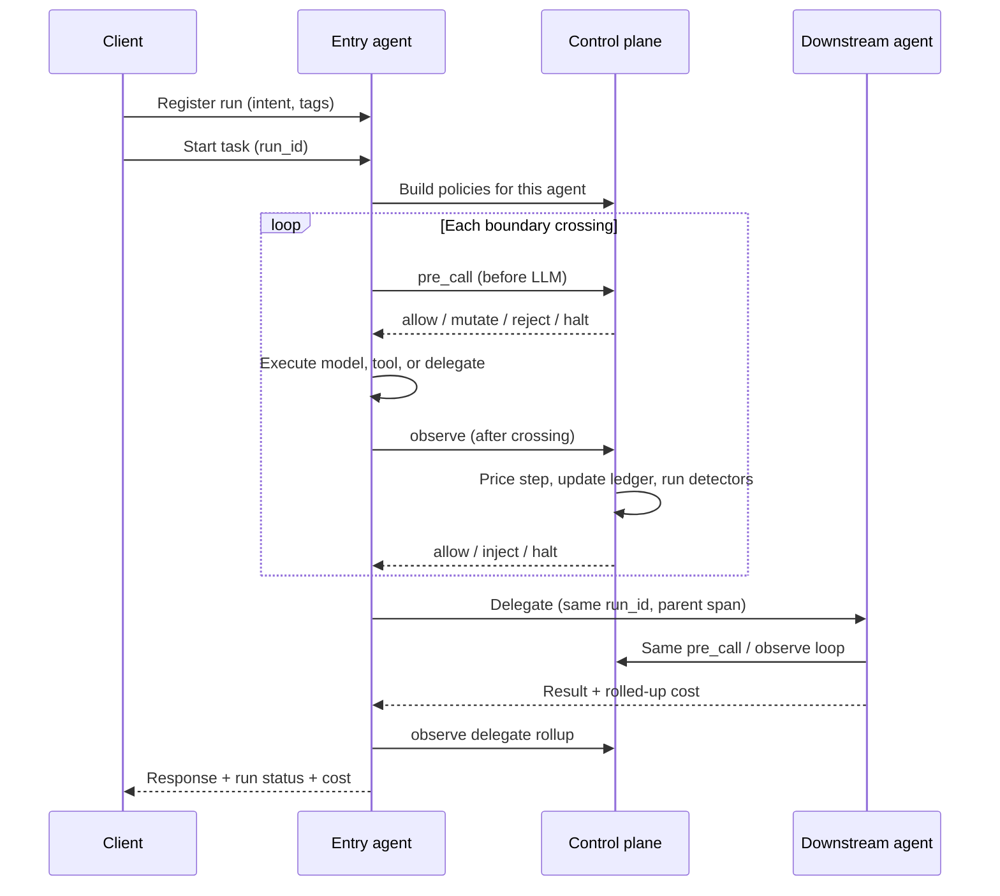

# Workflow

How TokenOps governs one agent run, from registration to halt or completion.

## End-to-end flow



## Step by step

### 1. Register the run

Before any telemetry, the client registers a `run_id` with:

- **Intent** — server-resolved workflow label (e.g. pricing research, support triage)
- **User dimensions** — opaque tags you define (e.g. `user_id`, `Country`, plan tier)

Registration is immutable for the life of the run. Missing registration → fail closed.

### 2. Start the task

The entry agent receives the task with the run identifier propagated on every downstream call (HTTP headers in the demo bench; same idea in-process).

Each agent process loads the **active governance config** (budgets + policy instances) and builds a fresh control plane for that request.

### 3. Three enforcement moments

| Moment | When | Examples |
|---|---|---|
| **pre_call** | Before an LLM dispatch | Worst-case budget gate, concurrency cap, context compaction |
| **observe** | After each boundary completes | Cost budget, step cap, tool validation, progress guard |
| **tick** | On a clock (optional) | Stall / hang detection |

Detectors run read-only against the ledger. Signals route to policies. Policies emit **actions** (see [Policies & actions](./policies-and-actions.md)).

### 4. What counts as a boundary crossing

Each governed step is a **boundary crossing**:

- **LLM call** — model request/response
- **Tool call** — search, API, database, etc.
- **Delegate** — handoff to another agent or service

Every priced crossing updates the ledger: token usage → cost, step count, sliding window for behavioral detectors.

### 5. Multi-agent runs

In a pipeline (research → summarize in the demo bench):

- **Same `run_id`** across all agents
- **Child span** linked to parent for trace visibility
- Child spend **rolls up** into the parent run total
- **Shared ledger** — spend and halt live in SQLite so every process sees the same `run_llm_cap` headroom (not a fresh cap per agent)
- Policies on each agent can differ, but the run-level budget sees aggregate spend

→ [Multi-agent budgets (shared ledger)](./shared-ledger.md) — before/after screenshots

### 6. Outcome

| Status | Meaning |
|---|---|
| **completed** | Run finished within all policies |
| **halted** | A policy tripped HALT; further calls refused |
| **throttled** | Backpressure (reject/queue); caller may retry |

Halt preserves state: cost so far, reason, step history. Resume is deliberate — never automatic.

## Operator workflow (demo bench)

1. **Policy admin** — configure budgets and policy instances
2. **Run** — trigger from Test Bench (live agents) or Run simulator (in-process demo)
3. **Dashboard** — review run history, cost, halt reasons
4. **Simulator** — inspect trace, control-plane signals, and ledger windows per run

Changes in Policy admin apply on the **next run** — no redeploy required in the demo harness.

## Configuration model (conceptual)

```
Budgets     →  spend caps bound to a segment (run, user, tag, …)
Policies    →  template + parameters, optionally linked to a budget
Segments    →  named matchers (advanced; single-dimension scoping ships first)
```

The demo bench seeds a default stack (run budget + ten policies). Operators edit via the admin UI or API equivalent in production deployments.

---

Next: [Demo bench walkthrough](./demo-bench.md) · [Policies & actions](./policies-and-actions.md)
