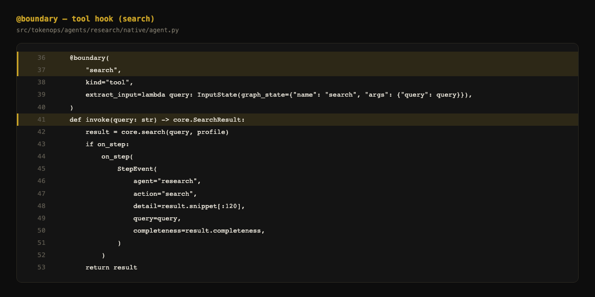
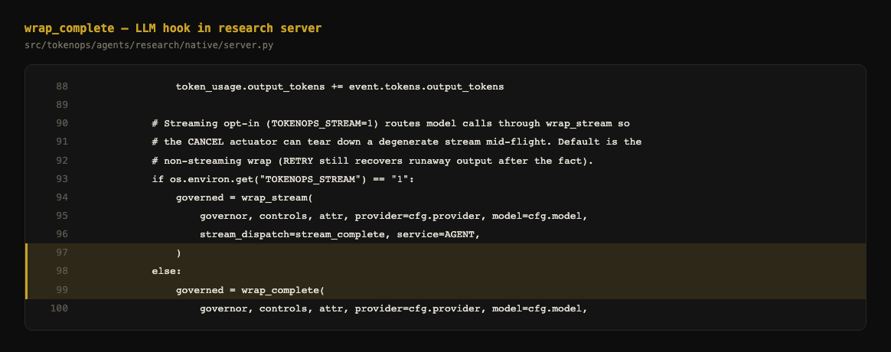
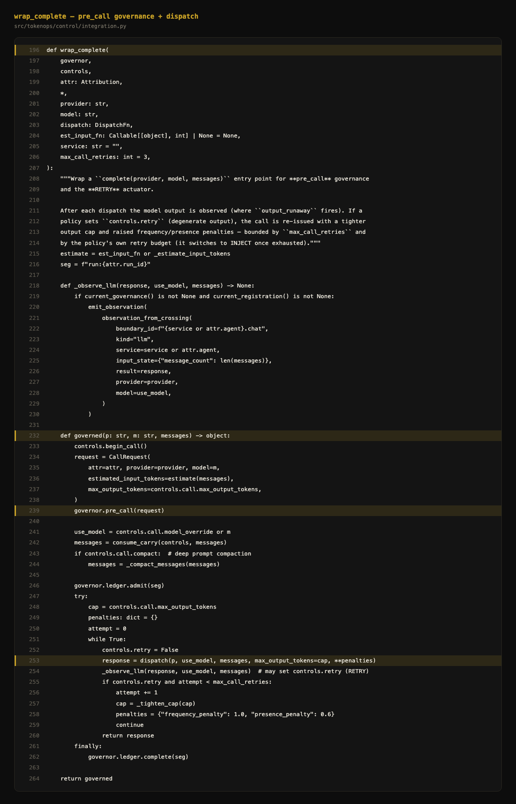
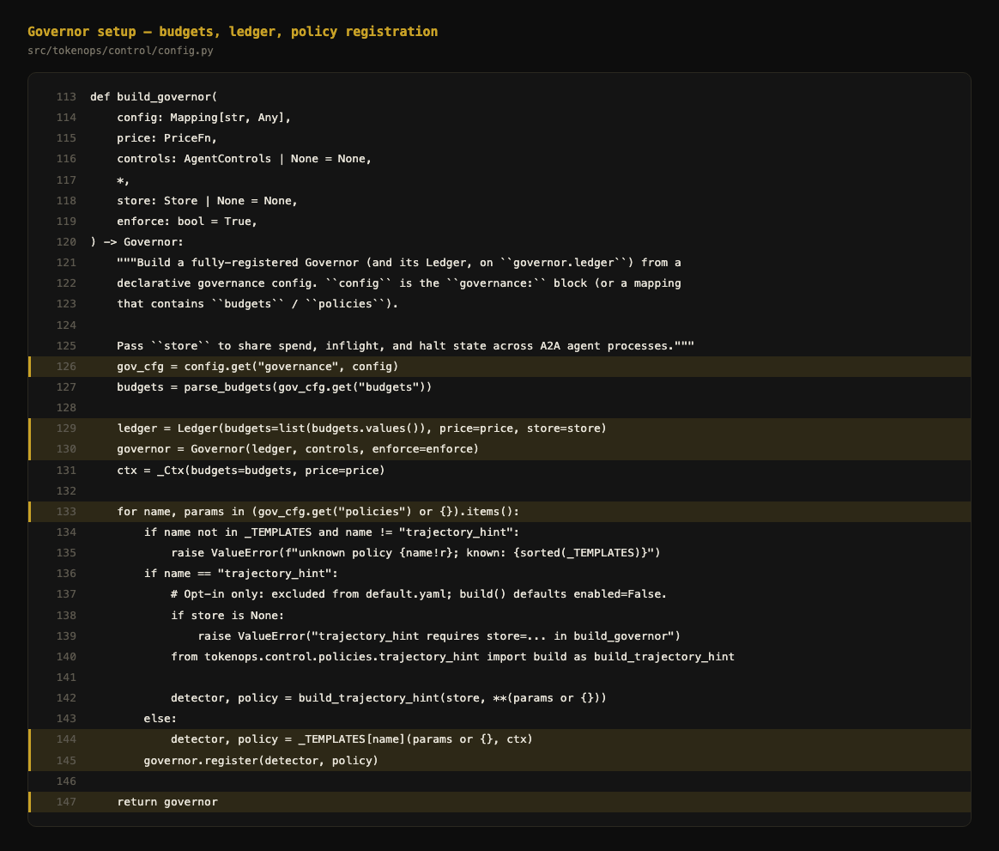

# Code screenshots — native test agent

Generated PNGs live in `demo-assets/code/` (run `python scripts/capture_demo_media.py`).

---

## 1. Tool hook — @boundary

**File:** `bench/agents/research/native/agent.py`  
**Lines:** 36–53 (`@boundary` on search)

---

## 2. LLM hook — wrap_complete (server)

**File:** `bench/agents/research/native/server.py`  
**Lines:** 88–100 (`wrap_complete` wires `complete` through governance)

---

## 3. Generic integration — wrap_complete

**File:** `src/tokenops/control/integration.py`  
**Lines:** 196–264 (pre_call, dispatch, observe)

---

## 4. Governor setup — build_governor

**File:** `src/tokenops/control/config.py`  
**Lines:** 113–147 (`build_governor` wires ledger + policy templates)

---

## 5. Run registration + governance scope

**File:** `bench/agents/research/native/server.py`  
**Lines:** 53–71 (run registration, `build_governor`, `create_run`)

---

## Slide mapping

| Slide | Screenshot |
|-------|------------|
| Architecture | `test-agent-integration.svg` or `docs/tokenops-architecture.svg` |
| Tool integration | `code/01_boundary_search_tool.png` |
| LLM integration | `code/02_wrap_complete_server.png` |
| Control plane depth | `code/03_wrap_complete_integration.png` |
| Governor setup | `code/04_governor_setup.png` |

## Demo videos

| Scenario | File |
|----------|------|
| Governance OFF — spend exceed | `videos/governance_demo_all_scenarios.webm` (scenario 1) |
| Governance ON — budget cap | same reel (scenario 2) |
| Governance ON — cost guard | same reel (scenario 3) |

Single continuous recording with gold/black scenario banner overlay. Re-capture: `python scripts/capture_demo_media.py --videos-only`
